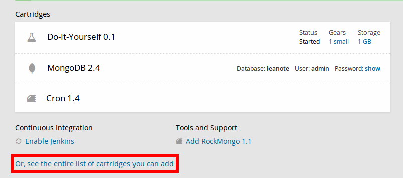
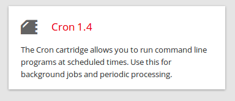

##Openshift cronjob restart APP##
**1. Add cronjob support**

Add this


**2. Add restart script**
ssh Login to app, go to the following dir

```shell
cd app-root/runtime/repo/.openshift/cron/hourly
```
Add the following script
**restart.sh**

```shell
#!/bin/bash
export TZ='Asia/Shanghai'
curl -I ${OPENSHIFT_APP_DNS} 2> /dev/null | head -1 | grep -q '200\|301\|302'
s=$?
if [ $s != 0 ];
    then
        echo "`date +"%Y-%m-%d %H:%M:%S"` down" >> ${OPENSHIFT_DATA_DIR}web_error.log
        echo "`date +"%Y-%m-%d %H:%M:%S"` restarting..." >> ${OPENSHIFT_DATA_DIR}web_error.log
        /usr/bin/gear stop 2>&1 /dev/null
        /usr/bin/gear start 2>&1 /dev/null
        echo "`date +"%Y-%m-%d %H:%M:%S"` restarted!!!" >> ${OPENSHIFT_DATA_DIR}web_error.log
else
    echo "`date +"%Y-%m-%d %H:%M:%S"` is ok" > ${OPENSHIFT_DATA_DIR}web_run.log
fi
```

**3. Change script chmod to 711**
```shell
chmod 711 restatr.sh
```